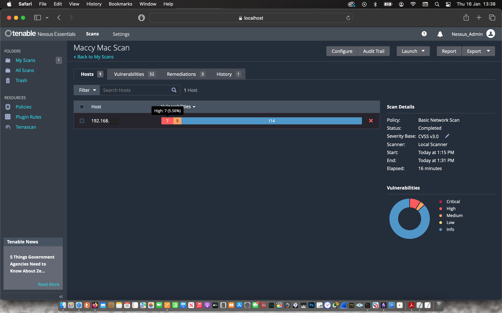
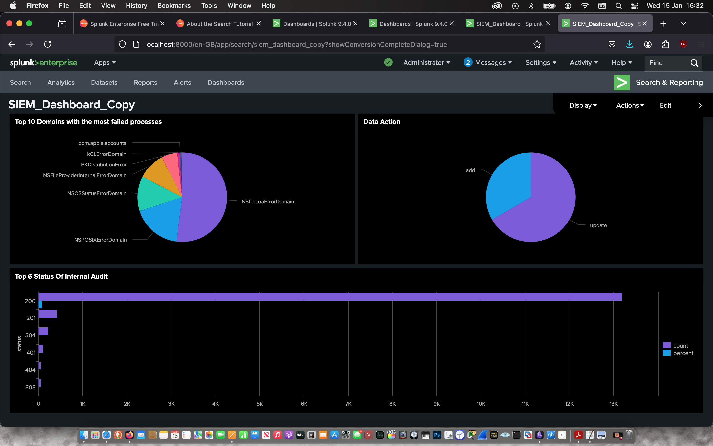
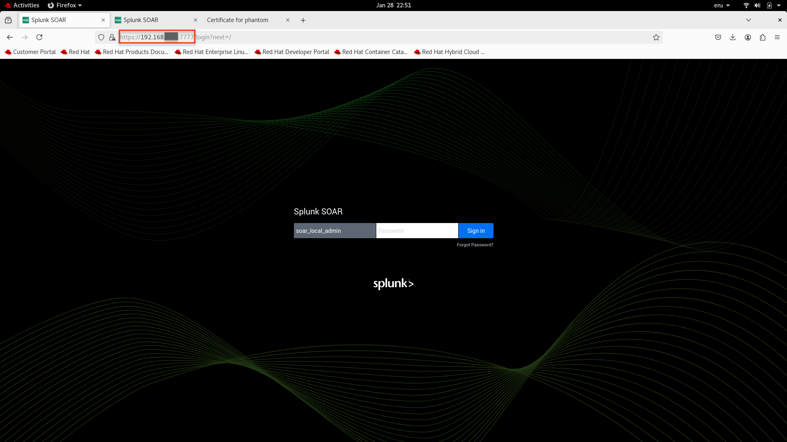

* * *

## Basic Vulnerability Management

This **Vulnerability Management Project** leverages **Tenable Nessus** to proactively identify and mitigate security risks on my MacBook Pro, ensuring a robust and well-defended system. Through targeted scans, the project **uncovers potential vulnerabilities**, ranging from **outdated software and misconfigurations to missing patches** — providing a clear roadmap for remediation. Each finding is assessed by severity, with **solutions implemented through timely updates, configuration adjustments, and security best practices**. By conducting regular scans and tracking improvements, this project reinforces a **proactive approach to cybersecurity hygiene and continuous monitoring**, sharpening key vulnerability management skills while maintaining a resilient and secure system.

Click [here](https://sodiq-genius.github.io/nessus.github.io/) to view this project

* * *

## First SIEM

This **SIEM Project** harnesses the power of **Splunk Enterprise** to transform raw system logs from my MacBook Pro into actionable security insights. By **ingesting, analysing, and visualising log data**, the project focuses on detecting potential threats, such as unauthorised access attempts, system misconfigurations, and unusual activity. Custom **dashboards, alerts, and search queries** are designed to uncover security events in real time, enhancing visibility and response capabilities. Through continuous tuning and analysis, this project strengthens **SIEM fundamentals**, including **log correlation, threat detection, and incident response**, while reinforcing a proactive approach to **cybersecurity monitoring and defence**.

Click [here](https://sodiq-genius.github.io/firstsiem.github.io/) to view this project

* * *

## Splunk SOAR Deployment

This **Splunk SOAR Installation Project** showcased strong **research, troubleshooting, and problem-solving skills** while deploying **Splunk SOAR** on my laptop running **RHEL 8**. The installation presented unique challenges, including **Wi-Fi connectivity issues** due to RHEL 8’s lack of native support, requiring creative network configuration workarounds. Additionally, a **volume allocation issue** hindered storage setup, demanding in-depth troubleshooting to ensure a stable deployment. Through persistent **research, technical documentation review, and hands-on experimentation**, these challenges were successfully resolved. This project not only deepened my expertise in **SOAR deployment and system configurations** but also reinforced my ability to **diagnose and resolve complex technical issues.

Click [here](https://sodiq-genius.github.io/soarinstallation.github.io/) to view this project

* * *
